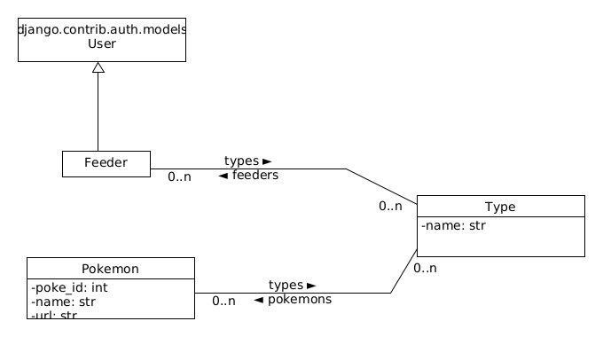

# Over authenticated Pokemon API

## Setup

0. Git clone the project, enter pokemon folder,

1. Install your python virtual environment:

    ```python3 -m venv .venv```

2. Source the environment:

    ```source .venv/bin/activate```

3. And install python requirement

    ```pip install -r requirements.txt```


4. Migrate the database:

    ```cd overpokeapi```
    ```python manage.py migrate```

5. Populate the catalog of pokemons and types:

    ```python manage.py populate_catalog```

6. Create a super user to access django admin application:

    ```python manage.py createsuperuser```

7. Run the development server:

    ```python manage.py runserver 0.0.0.0:5555```

8. Enter admin  application and create user you need:

    http://localhost:5555/admin in your favorite browser
    

## Domain model



## API

### Without authentication

#### > Login
POST /api/login

JSON Body must look like and the user must be previously created using admin application

```json
{
    "username": "olivier",
    "password": "ViveDjango"
}
```

Response


```json
{
    "token": "<your_token>"
}
```

### With authentication

Before executing request ensure header contains key / value
```Authorization: Token <your_token>```
    

#### > view current logged user    
GET /api/user/me

Response

```json
{
    "user": "olivier",
    "types": [
        "ground",
        "ghost"
	]
}
```

#### > Add a group to current logged user    
POST /api/group/<type_id>/add

Response has the same structure as View current logged user with added group

#### > Remove a group from the current logged user    
POST /api/group/<type_id>/remove

Response has the same structure as View current logged user with removed group

#### > View all pokemons of the current user according to types he owns
GET /api/pokemon

Response is paginated and show basic information on pokemons
```json
{
	"count": 181,
	"next": "http://127.0.0.1:5555/api/pokemon?page=2",
	"previous": null,
	"results": [
		{
			"poke_id": 27,
			"name": "sandshrew",
			"url": "https://pokeapi.co/api/v2/pokemon/27/",
			"types": [
				{
					"name": "ground"
				}
			]
		},
        ...
    ]
```

#### > View one pokemon if the user can see it according to types matching between user and pokemon
GET /api/pokemon/<pokemon_id_or_name>

Response is the same strucutre as Poke API when requesting an identifed pokemon